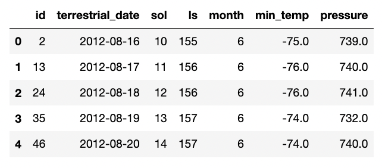
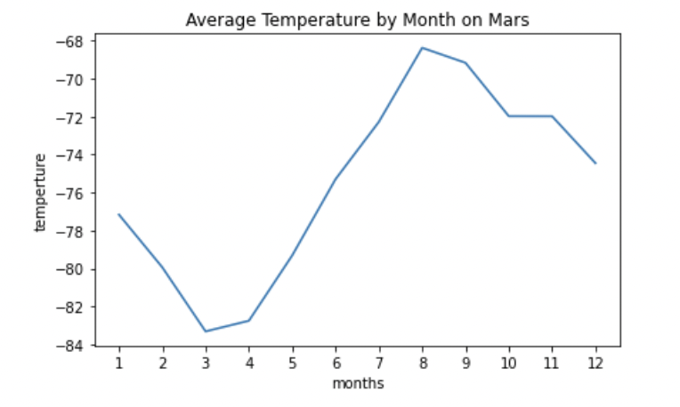
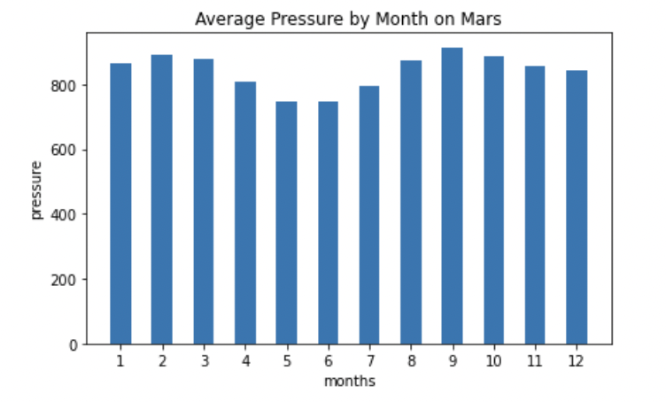
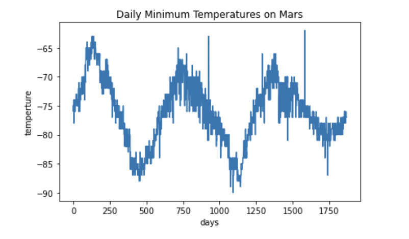

## Exploring Mars Data 

BeautifulSoup Web Scraping to Analyze Data about Mars

### Datasets:

 [Mars News](https://redplanetscience.com//), [Mars Weather](https://data-class-mars-challenge.s3.amazonaws.com/Mars/index.html)

## Objective #1: Scrape Titles and Preview Text from Mars News

### Step 1 - Visit the Website

Use automated browsing to visit the Mars NASA news site. 

* Inspect the page to identify which elements to scrape.

### Step 2 - Scrape the Website 

* Create a Beautiful Soup object and use it to extract text elements from the website

### Step 3 - Store the Results

* Extract the titles and preview text of the news articles that you scraped
    * Store each title-and-preview pair in a Python dictionary
    * Give each dictionary two keys: title and preview
    * Store all the dictionaries in a Python list

### Step 4 - Export the Data

* Store the scraped data in a file to ease sharing the data with others
    * Export the scraped data to a JSON file 

---------------------------------------------------

## Objective #2: Scrape and Analyze Mars Weather Data

### Step 1 - Visit the Website

Use automated browsing to visit the Mars Temperature Data Site

* Inspect the page to identify which elements to scrape

### Step 2 - Scrape the Table 

* Create a Beautiful Soup object and use it to scrape the data in the HTML table

### Step 3 - Store the Data

* Assemble the scraped data into a Pandas DataFrame
* The columns should have the same headings as the table on the website:
    * id: the identification number of a single transmission from the Curiosity rover
    * terrestrial_date: the date on Earth
    * sol: the number of elapsed sols (Martian days) since Curiosity landed on Mars
    * ls: the solar longitude
    * month: the Martian month
    * min_temp: the minimum temperature, in Celsius, of a single Martian day (sol)
    * pressure: The atmospheric pressure at Curiosity's location

### Step 4 - Prepare Data for Analysis

* Examine the data types that are currently associated with each column
    * Cast the data to the appropriate datetime, int, or float data types
    
### Step 5 - Analyze the Data
    
* Analyze the dataset by using Pandas functions

* Find the average the minimum daily temperature for all of the months
    * Plot the results as a line chart.
    

* Find the average the daily atmospheric pressure of all the months
    * Plot the results as a bar chart
    

* Consider how many days elapse on Earth in the time that Mars circles the Sun once
    * Visually estimate the result by plotting the daily minimum temperature

### Step 6 - Save the Data

* Export the DataFrame to a CSV file

---------------------------------------------------

<b>Contact:</b> bronwynmilne64@gmail.com
